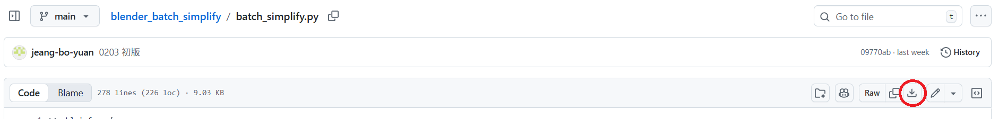
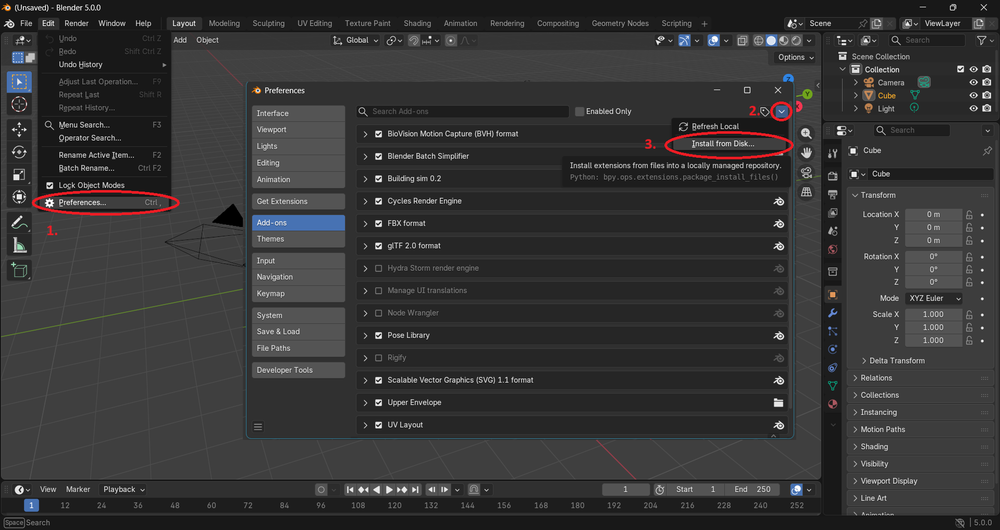
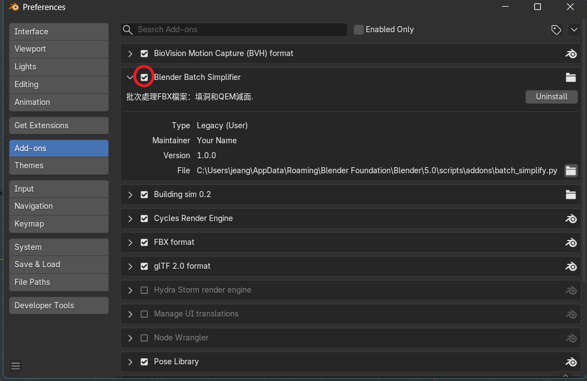
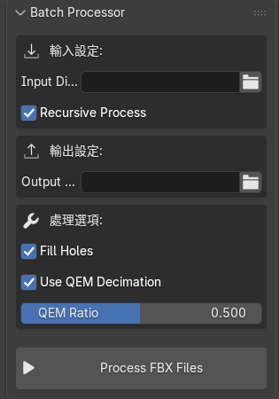

# blender_batch_simplify

用來批次化減 fbx 模型的插件。

# Installation

Step 1. 下載 [batch_simplify.py](./batch_simplify.py)

Step 2. 開啟 Blender 然後安裝前一步下載的 batch_simplify.py

Step 3. 確認 Blender Batch Simplifier 有被啟用
（每次重新安裝後都要重新啟用或重開 Blender）

# Usage

指定輸入資料夾和輸出資料夾，然後點擊下方的 "Processs FBX Files"。該插件會針對輸入資料夾下的每個模型做化減，然後輸出到輸出資料夾中。

化減完後，可以先檢查化減的結果，再從輸出資料夾中將檔案蓋掉原本的檔案。

輸入資料夾若包含 FBX 以外的檔案，程式會自動略過。

